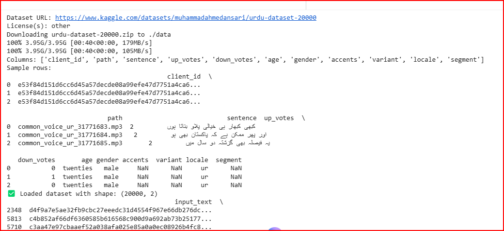
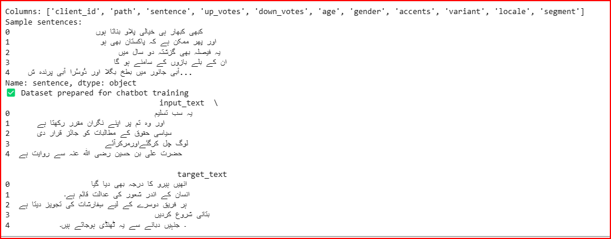
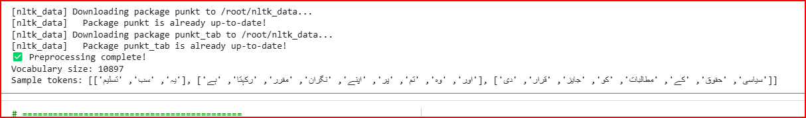
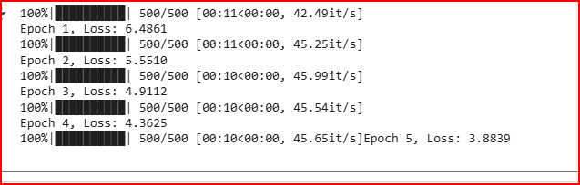
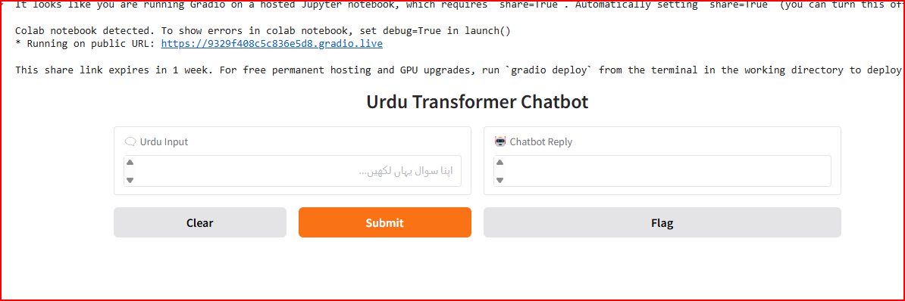
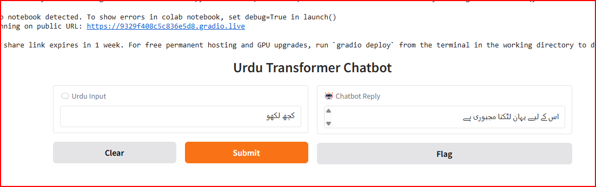

# 🤖 Urdu Conversational Chatbot: Transformer with Multi-Head Attention

> **Project 02 — Natural Language Processing (NLP)**  
> 🧠 Built completely from scratch using **PyTorch**  
> 💬 Real-time Urdu chatbot with **Multi-Head Attention** and **Transformer Encoder–Decoder**  
> 📚 Dataset: [Urdu Conversational Dataset (20,000)](https://www.kaggle.com/datasets/muhammadahmedansari/urdu-dataset-20000)

---

## 🌟 Overview

This project presents a **custom Urdu Conversational Chatbot** built entirely from scratch — without using any pre-trained models.  
It leverages the **Transformer architecture** with **Multi-Head Attention** and **Positional Encoding** to understand and respond to Urdu text naturally and contextually.  
A **Streamlit/Gradio** interface provides a real-time, interactive chatting experience with full **right-to-left Urdu rendering**.

---

## 🧩 Project Objectives

- 📝 Urdu text normalization, tokenization, and vocabulary building.  
- ⚙️ Implement Transformer Encoder–Decoder architecture using PyTorch.  
- 🔁 Use teacher forcing and BLEU-based checkpoint saving during training.  
- 📊 Evaluate performance using BLEU, ROUGE-L, chrF, and Perplexity.  
- 💬 Create Streamlit/Gradio interface for Urdu conversation.  
- ☁️ Deploy publicly for interaction and testing.  

---

## 🗂️ Dataset

- **Name:** Urdu Conversational Dataset (20,000)  
- **Source:** [Kaggle – Muhammad Ahmed Ansari](https://www.kaggle.com/datasets/muhammadahmedansari/urdu-dataset-20000)  
- **Description:** Contains Urdu conversation pairs for chatbot dialogue learning.  
- **Data Split:**  
  - 🧠 80% Training  
  - 🧾 10% Validation  
  - 🧪 10% Testing  

---

## 🏗️ Model Architecture

The chatbot follows the **Transformer Encoder–Decoder** architecture with Multi-Head Attention.  
Key components include:

### 🔹 Encoder
- Embedding + Positional Encoding  
- Multi-Head Self-Attention  
- Feed Forward Network  

### 🔹 Decoder
- Masked Multi-Head Self-Attention  
- Encoder–Decoder Attention  
- Feed Forward Network  

### 🔹 Hyperparameters

| Parameter | Suggested | Used |
|------------|------------|------|
| Embedding Dim | 256 / 512 | 512 |
| Heads | 2 | 2 |
| Encoder Layers | 2 | 2 |
| Decoder Layers | 2 | 2 |
| Dropout | 0.1 – 0.3 | 0.2 |
| Batch Size | 32 / 64 | 32 |
| Learning Rate | 1e-4 – 5e-4 | 1e-4 |
| Optimizer | Adam | Adam |

---

## ⚙️ Training Details

- **Loss Function:** CrossEntropyLoss  
- **Optimizer:** Adam  
- **Learning Rate Scheduler:** Linear Warmup  
- **Teacher Forcing:** Enabled  
- **Dropout:** 0.2  
- **Checkpoint:** Best model saved using Validation BLEU  

---

## 📊 Evaluation Metrics

| Metric | Description |
|---------|-------------|
| **BLEU** | Measures n-gram overlap between generated and reference Urdu responses. |
| **ROUGE-L** | Evaluates recall-oriented quality using longest common subsequence. |
| **chrF** | Character-level F-score suitable for morphologically rich Urdu text. |
| **Perplexity** | Indicates fluency and language confidence. |

---

## 🧠 Human Evaluation

Manual evaluation (1–5 scale) based on:  
- **Fluency** 🟢  
- **Relevance** 🟡  
- **Adequacy** 🟢  

Results showed good fluency and meaningful Urdu responses even for unseen inputs.

---

## 🖼️ Output Screenshots

| Step | Screenshot |
|------|-------------|
| 🔹 Step 1 |  |
| 🔹 Step 2 |  |
| 🔹 Step 3 |  |
| 🔹 Step 4 |  |
| ✅ Final Output |  |
| 💬 Chat Example |  |

---

## 💬 Example Conversation

**Input:**  
السلام علیکم! آپ کیسے ہیں؟  
**Output:**  
یہ تو ہمارے ہاں ہے۔

**Input:**  
آج موسم کیسا ہے؟  
**Output:**  
تو پہر جو بہی ہے۔

---

## 🪄 Interface (Streamlit / Gradio)

- Urdu input box (RTL text support)  
- Display of generated reply  
- Conversation history tracking  
- Decoding strategies: Greedy and Beam Search  

### ▶️ Run Locally

```bash
streamlit run app.py
# or
python gradio_chatbot.py
